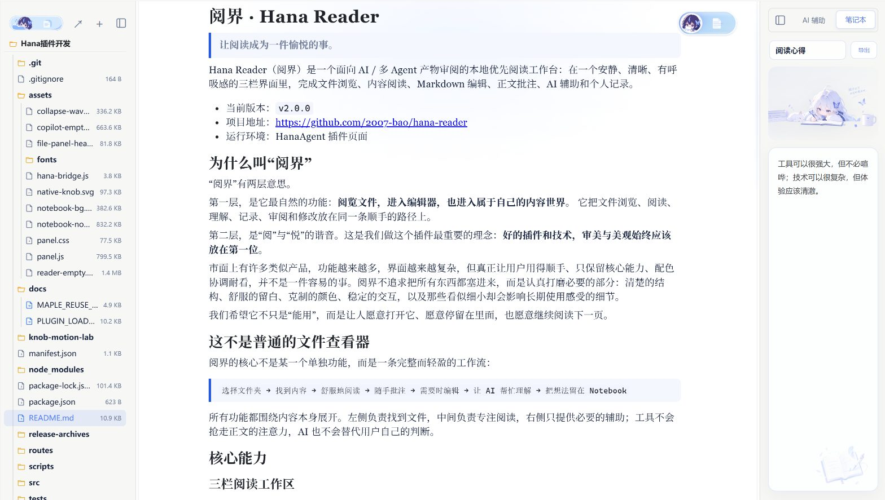
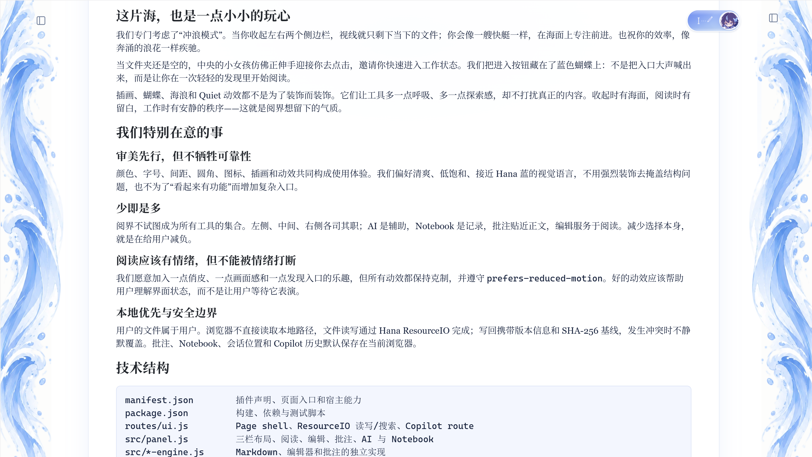

# 阅界 · Hana Reader

> **让阅读成为一件愉悦的事。**

Hana Reader（阅界）是一个面向 AI / 多 Agent 产物审阅的本地优先阅读工作台：在一个安静、清晰、有呼吸感的三栏界面里，完成文件浏览、内容阅读、Markdown 编辑、正文批注、AI 辅助和个人记录。

- 当前版本：`v2.0.0`
- 项目地址：<https://github.com/2007-bao/hana-reader>
- 运行环境：HanaAgent 插件页面

<p align="center">
  
</p>

<p align="center"><sub>从一只藏在蓝色蝴蝶里的入口开始，轻轻进入阅读。</sub></p>

## 为什么叫“阅界”

“阅界”有两层意思。

第一层，是它最自然的功能：**阅览文件，进入编辑器，也进入属于自己的内容世界。** 它把文件浏览、阅读、理解、记录、审阅和修改放在同一条顺手的路径上。

第二层，是“阅”与“悦”的谐音。这是我们做这个插件最重要的理念：**好的插件和技术，审美与美观始终应该放在第一位。**

市面上有许多类似产品，功能越来越多，界面越来越复杂，但真正让用户用得顺手、只保留核心能力、配色协调耐看，并不是一件容易的事。阅界不追求把所有东西都塞进来，而是认真打磨必要的部分：清楚的结构、舒服的留白、克制的颜色、稳定的交互，以及那些看似细小却会影响长期使用感受的细节。

我们希望它不只是“能用”，而是让人愿意打开它、愿意停留在里面，也愿意继续阅读下一页。

## 这不是普通的文件查看器

阅界的核心不是某一个单独功能，而是一条完整而轻盈的工作流：

```text
选择文件夹 → 找到内容 → 舒服地阅读 → 随手批注 → 需要时编辑 → 让 AI 帮忙理解 → 把想法留在 Notebook
```

所有功能都围绕内容本身展开。左侧负责找到文件，中间负责专注阅读，右侧只提供必要的辅助；工具不会抢走正文的注意力，AI 也不会替代用户自己的判断。

## 核心能力

### 三栏阅读工作区

阅界采用清晰的三栏结构：文件树、阅读 / 编辑区、AI 与 Notebook。每一栏都有自己的职责，彼此靠近，却不互相打扰。

<p align="center">
  
</p>

<p align="center"><sub>标准、稳定、可呼吸的三栏工作台：找到内容，专注内容，也留下内容。</sub></p>

- 左侧文件树：选择文件夹、展开目录、刷新内容和打开本地目录。
- 中间阅读区：Markdown 安全渲染、GFM 表格、任务列表、代码高亮和安全 HTML 预览。
- 右侧工具栏：AI 辅助与唯一 Notebook。
- 面板支持宽度调整、折叠和状态恢复。

### 阅读与编辑

- Markdown 使用本地 Milkdown 所见即所得编辑器。
- 代码和其他文本使用轻量源码编辑器。
- 支持自动保存、撤销、版本冲突提示和安全写回。
- 对读取、编辑和搜索设置边界，避免大文件或异常内容拖垮工作区。

### 正文批注

- 选中文本后，直接在正文附近添加高亮、划线或擦除标记。
- 批注使用稳定文本锚点保存在浏览器本地，不改写原始 Markdown。
- 只读状态下也能完成批注，并可撤销最近一次标记操作。

### AI 辅助

- 通过 Hana `model:sample-text` 接入文本模型。
- 默认只发送当前文件、用户明确选中的文本和当前对话历史。
- 支持 Enter 发送、Shift + Enter 换行、失败重试和按文件保存对话。
- 模型暂不可用时，阅读、编辑和 Notebook 仍然独立可用。

## AI 接口与安全说明

### 阅界有没有暴露自己的 AI 接口或密钥？

没有。阅界没有把任何 API Key、Cookie、模型供应商密钥或个人账号写入源码、`manifest.json`、前端 bundle 或安装包。仓库中的 AI 代码只描述“如何向 Hana 宿主请求文本模型”，并不持有模型供应商的凭据。

当前链路是：

```text
前端 panel.js
  → 插件自己的 /copilot/ask route
  → Hana 宿主提供的 model:sample-text bus
  → Hana 当前配置的文本模型
```

前端请求自己的 route 时还会携带 Hana 的 surface session；服务端 route 从请求上下文取得宿主 bus，再调用 `bus.request('model:sample-text', ...)`。因此，模型账号、供应商密钥和实际计费关系属于 Hana 宿主的配置边界，不属于公开插件仓库。

需要诚实说明的是：用户主动提交给 Copilot 的当前文件、选区和对话历史，会被发送到 Hana 当前配置的模型服务。这不是“泄露插件密钥”，但涉及用户内容的隐私边界；使用者应避免把不应离开本机的秘密内容交给模型。

### 其他插件如何实现自己的 AI 功能？

推荐复用 Hana 的宿主模型总线，而不是在插件里硬编码第三方 API：

1. 在 `manifest.json` 声明所需能力：

   ```json
   { "capabilities": ["model.sample"] }
   ```

2. 在插件的服务端 route 中取得宿主上下文，并调用文本模型：

   ```js
   const requestContext = c.get('pluginRequestContext');
   const bus = requestContext?.bus || pluginCtx?.bus;
   const result = await bus.request('model:sample-text', {
     pluginId: pluginCtx?.pluginId,
     operation: 'your-plugin-operation',
     systemPrompt: '只描述必要的任务约束。',
     messages: [{ role: 'user', content: prompt }],
     maxTokens: 1200,
     temperature: 0.2,
   });
   ```

3. 前端只调用自己的插件 route，例如 `/copilot/ask`，不要直接从浏览器请求第三方模型。
4. 对 prompt、文件内容、选区和历史记录做长度限制与字段白名单，只发送用户明确需要的上下文。
5. 不要把 API Key 放在 `src/`、`assets/`、`manifest.json`、构建产物或 Git 提交中。若确实要接入外部服务，应由宿主或受保护的服务端配置密钥。
6. 对模型不可用、超时、空响应和敏感数据提示做清晰的本地兜底。

这样，插件作者可以拥有自己的系统提示词、上下文裁剪、结果解析和界面体验，同时把凭据管理、模型选择和权限边界交给 Hana 宿主处理。

### 单一 Notebook

v2.0.0 将 Notebook 收束为一个真正安静的个人记录空间：

- 顶部只有“笔记名称”和“导出”。
- 下方是一张正在记笔记的插画。
- 编辑区带有约 50% 透明度的笔记本背景，不遮挡文字。
- 内容自动保存在浏览器本地。
- 导出通过 Hana ResourceIO 安全覆盖已有文本文件。

## 这片海，也是一点小小的玩心

我们专门考虑了“冲浪模式”。当你收起左右两个侧边栏，视线就只剩下当下的文件；你会像一艘快艇一样，在海面上专注前进。也祝你的效率，像奔涌的浪花一样疾驰。

当文件夹还是空的，中央的小女孩仿佛正伸手迎接你去点击，邀请你快速进入工作状态。我们把进入按钮藏在了蓝色蝴蝶上：不是把入口大声喊出来，而是让你在一次轻轻的发现里开始阅读。

插画、蝴蝶、海浪和 Quiet 动效都不是为了装饰而装饰。它们让工具多一点呼吸、多一点探索感，却不打扰真正的内容。收起时有海面，阅读时有留白，工作时有安静的秩序——这就是阅界想留下的气质。

<p align="center">
  
</p>

<p align="center"><sub>收起侧栏，专注当前文件；愿你的执行力也像浪花一样一路疾驰。</sub></p>

## 我们特别在意的事

### 审美先行，但不牺牲可靠性

颜色、字号、间距、圆角、图标、插画和动效共同构成使用体验。我们偏好清爽、低饱和、接近 Hana 蓝的视觉语言，不用强烈装饰去掩盖结构问题，也不为了“看起来有功能”而增加复杂入口。

### 少即是多

阅界不试图成为所有工具的集合。左侧、中间、右侧各司其职；AI 是辅助，Notebook 是记录，批注贴近正文，编辑服务于阅读。减少选择本身，就是在给用户减负。

### 阅读应该有情绪，但不能被情绪打断

我们愿意加入一点俏皮、一点画面感和一点发现入口的乐趣，但所有动效都保持克制，并遵守 `prefers-reduced-motion`。好的动效应该帮助用户理解界面状态，而不是让用户等待它表演。

### 本地优先与安全边界

用户的文件属于用户。浏览器不直接读取本地路径，文件读写通过 Hana ResourceIO 完成；写回携带版本信息和 SHA-256 基线，发生冲突时不静默覆盖。批注、Notebook、会话位置和 Copilot 历史默认保存在当前浏览器。

## 技术结构

```text
manifest.json        插件声明、页面入口和宿主能力
package.json         构建、依赖与测试脚本
routes/ui.js         Page shell、ResourceIO 读写/搜索、Copilot route
src/panel.js         三栏布局、阅读、编辑、批注、AI 与 Notebook
src/*-engine.js      Markdown、编辑器和批注的独立实现
src/notebook-store.js Notebook 本地存储、迁移与导出数据
assets/panel.js      构建后的前端 bundle
assets/panel.css     布局、主题、控件与 Quiet 动效
assets/notebook-*.png Notebook 插画资源
assets/fonts/        Maple Mono 与许可证文本
tests/               结构、渲染、编辑器、路由和存储回归
docs/                页面加载与上游视觉资源说明
release-archives/    历史安装包归档
```

## 数据与安全

- Hana ResourceIO 是访问用户文件的唯一边界。
- 读取和写回都有大小限制；二进制文件不会被当作普通文本渲染。
- 安全写回要求 `expectedVersion` 与 `baseSha256`，远端变化时保留冲突信息。
- HTML 预览使用 sandbox 与净化；Markdown 原始 HTML 默认按安全文本处理。
- 本地存储只保存 Notebook、批注、会话位置和 Copilot 历史，不上传真实项目文件到仓库。
- 项目仓库不包含 API Key、Cookie、会话导出或个人文件。

## 安装与开发

将仓库目录作为 HanaAgent 插件安装，或使用插件开发工具加载本目录。

```powershell
npm install
npm test
```

`npm test` 会依次执行版本一致性检查、esbuild 构建和完整顺序测试。构建产物为 `assets/panel.js`。

发布前请确认：

1. `manifest.json`、`package.json`、`package-lock.json`、`src/panel.js` 和 `routes/ui.js` 版本一致；
2. `assets/panel.js` 已由源码重新构建；
3. Notebook 插画资源存在；
4. 全部测试通过；
5. 安装包只包含插件运行所需文件。

页面加载与鉴权排查见 [`docs/PLUGIN_LOADING.md`](docs/PLUGIN_LOADING.md)，Maple 上游资源与许可证边界见 [`docs/MAPLE_REUSE_AUDIT.md`](docs/MAPLE_REUSE_AUDIT.md)。

## Contributors

- **2007-bao** — 项目发起人、产品方向、审美理念、交互设计与验收。
- **岚诺（HanaAgent · GPT-5.6 Luna）** — 插件实现、视觉收束、测试维护、文档整理与发布管理。

完整贡献说明见 [`CONTRIBUTORS.md`](CONTRIBUTORS.md)。

## 发布与历史

当前稳定版本为 `v2.0.0`，对应的安装包与早期版本包统一收纳在 [`release-archives/`](release-archives/)；版本标签和 Git 提交用于追溯源码，安装包用于直接安装。

历史版本不再在 README 中逐版罗列。这样 README 只负责讲清楚阅界是什么、为什么这样设计、现在能做什么，以及如何安全使用；具体的版本包和 Git 历史各自承担追溯职责。

## 后记

阅界花了超过三天，从一个空文件夹里的页面开始，慢慢长成现在的样子。我们写过很多代码，也反复推翻过很多看似“已经可以”的方案，最后留下的不是功能数量，而是一种更明确的判断：

> **工具可以很强大，但不必喧哗；技术可以很复杂，但体验应该清澈。**

愿每一次打开阅界，都像推开一扇安静的窗。文件在这里被看见，想法在这里被留下，而阅读本身，终于可以是一件令人愉悦的事。
